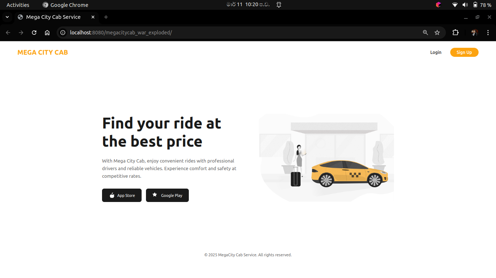
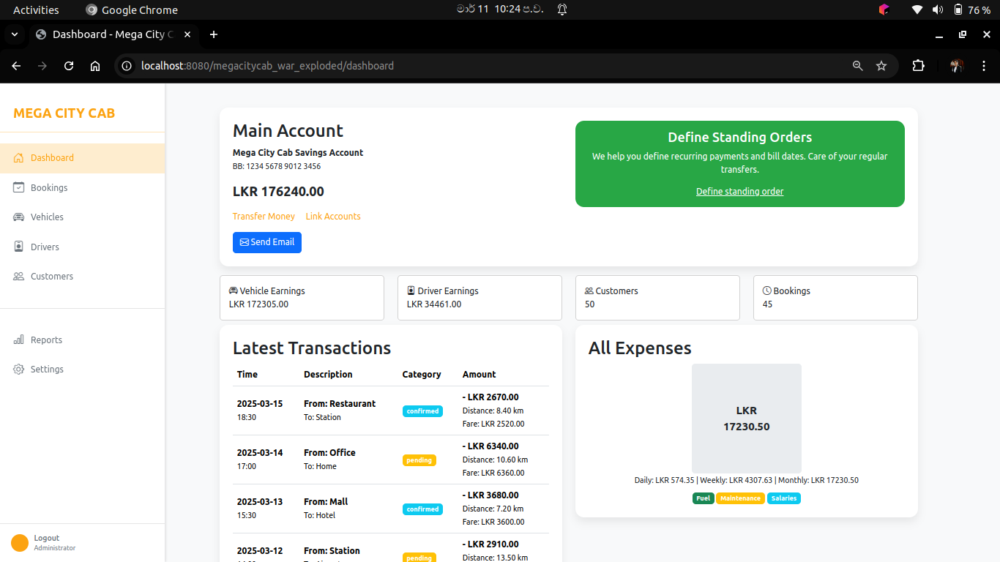
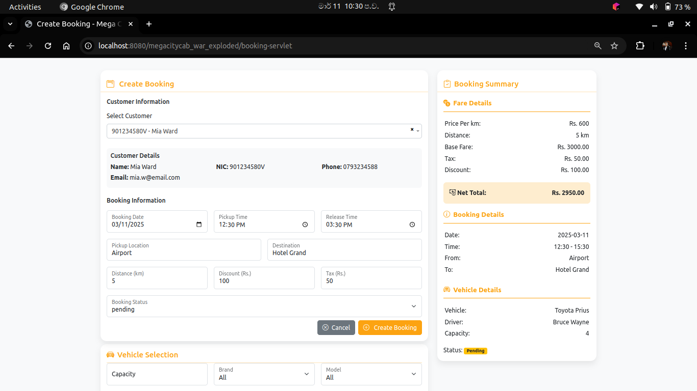
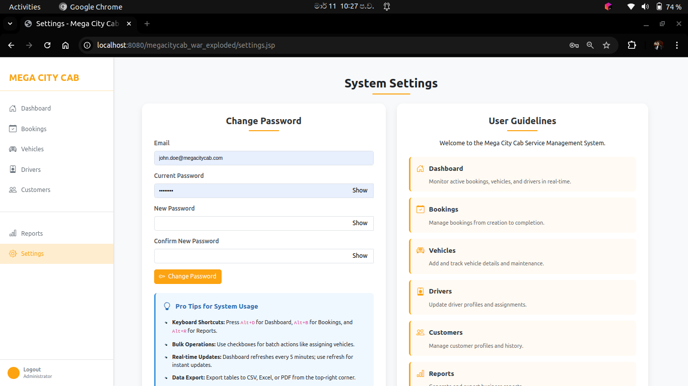

---

# Mega City Cab System 🚕


Welcome to the **Mega City Cab System**, a cutting-edge, computerized solution designed to revolutionize cab service management in Colombo City! 🌆 Built with Java EE, MySQL, and a robust layered architecture, this system streamlines operations for thousands of monthly customers, replacing manual processes with efficiency and security. 🚀

---

## 🚀 Project Overview

Mega City Cab is a popular cab service catering to the bustling streets of Colombo. With thousands of customers relying on our services monthly, we’ve transitioned from manual order and detail management to a modern, automated system. This project delivers a user-friendly, menu-driven application with advanced features like booking management, bill calculation, and comprehensive reporting—empowered by a secure, scalable architecture.

- **Objective**: Streamline cab service operations, enhance customer experience, and provide robust administrative tools.
- **Target Users**: System Users (company staff) with restricted access for security.
- **Technologies**: Java EE, MySQL, Maven, GitHub Actions (CI/CD), Layered Architecture.

---

## ✨ Key Features

- **Authentication & Security**:
    - Secure login with email and password.
    - Passwords stored hashed for enhanced security.
    - User registration with email confirmation (demo mode).

- **User Management**:
    - Register new users with email notifications.
    - Change password with optional reset functionality.
    - Logout feature for secure session termination.

- **Customer Management**:
    - CRUD operations (Create, Read, Update, Delete with soft delete).
    - Advanced filtering (all, registration No, name, email, mobile No).

- **Driver & Vehicle Management**:
    - Combined CRUD operations for drivers and vehicles.
    - Advanced filtering capabilities.

- **Booking Management**:
    - Add bookings with unique booking id.
    - View and update booking details (no delete, soft delete applied).
    - User can select a vehicle to make a booking.
    - Email notifications for booking updates (demo mode).

- **Billing**:
    - Calculate and email bills with taxes and discounts.

- **Reporting**:
    - View reports for customers, vehicle-drivers, and bookings.
    - Export reports as CSV with filters (all days, last 7 days, last 30 days).
    - Print reports.

- **Settings & Help**:
    - Access system guidelines in the settings section.
    - Change password.

- **Additional Enhancements**:
    - DTO-to-entity conversion for data integrity.
    - Soft delete for records to maintain data history.
    - CI/CD pipeline for automated testing and deployment.

---

## 🏗️ Architecture

The system follows a **Layered Architecture** for modularity and maintainability:

- **Presentation Layer**: Java EE servlets and JSP for user interfaces.
- **Service Layer**: Business logic with service classes and interfaces.
- **DAO Layer**: Data access objects for MySQL interactions.
- **Data Layer**: MySQL database with tables for users, customers, drivers, vehicles, and bookings.

### Technology Stack
| Component         | Technology                        |
|-------------------|-----------------------------------|
| Programming Language | Java 17                           |
| Web Framework     | Java EE                           |
| Database          | MySQL 8.0.33                      |
| Build Tool        | Maven                             |
| CI/CD             | GitHub Actions                    |
| Security          | Hashed Passwords, Security Filter |
| Email             | Demo Email Service                |

---

## 🚀 Getting Started

### Prerequisites
- **Java 17**: [Download JDK 17](https://www.oracle.com/java/technologies/javase-jdk17-downloads.html)
- **MySQL 8.0.33**: [Download MySQL](https://www.mysql.com/downloads/)
- **Maven**: [Install Maven](https://maven.apache.org/install.html)
- **Git**: [Install Git](https://git-scm.com/book/en/v2/Getting-Started-Installing-Git)

### Installation
1. **Clone the Repository**:
   ```bash
   git clone https://github.com/Ruvini-Rangathara/Mega-City-Cab-CIS6003
   cd mega-city-cab
   ```

2. **Set Up MySQL**:
    - Create a database named `mega_city_cab`.
    - Import the schema from `src/main/resources/schema.sql`.
    - Update `application.properties` with your MySQL credentials:
      ```properties
      db.url=jdbc:mysql://localhost:3306/mega_city_cab
      db.username=root
      db.password=your_password
      ```

3. **Build the Project**:
   ```bash
   mvn clean install
   ```

4. **Run the Application**:
    - Deploy the WAR file (e.g., `target/mega-city-cab.war`) to a Java EE server (e.g., Tomcat).
    - Access via `http://localhost:8080/mega-city-cab`.

5. **Login**:
    - Default credentials: `john.doe@megacitycab.com` / `admin123` (change immediately!).

---

## 🧪 Testing

- **Test Coverage**: Unit tests for DAO and Service layers.
- **Execution**:
  ```bash
  mvn test
  ```
- **Test Reports**: Generated and archived in `target/surefire-reports/`.

---

## 🔧 CI/CD Pipeline

The Mega City Cab System features a robust **CI/CD pipeline** powered by GitHub Actions, ensuring seamless automation of testing, building, and deployment across multiple environments. This pipeline enhances development efficiency and reliability by enforcing strict branch management and automated workflows.

- **Branch Strategy**:
    - `dev`: Development environment for new features.
    - `stage`: Staging environment for testing releases.
    - `release`: Pre-production environment for final validation.
    - `main`: Production environment for live deployment.

- **Key Processes**:
    - **Merge Validation**: Enforces strict pull request (PR) rules (e.g., PRs to `main` must come from `release`, `release` from `stage`, `stage` from `dev`).
    - **Unit Testing**: Executes tests for the `UserDaoImpl` layer with a MySQL service container.
    - **Building**: Compiles and packages the project, skipping tests for deployment builds.
    - **Deployment**: Automates deployment to `dev`, `stage`, `preprod`, and `production` environments based on branch pushes.

- **Monitoring**: Check the build status and detailed logs on the [Actions tab](https://github.com/Ruvini-Rangathara/Mega-City-Cab-CIS6003/actions) for real-time insights into pipeline execution.

This streamlined pipeline ensures high-quality code delivery with minimal manual intervention, making it a cornerstone of the project’s modern development practices.

---

## 📊 Reports & Filters

- **Report Types**: Customer, Vehicle-Driver, Booking.
- **Export Options**: Print or CSV.
- **Filters**:
    - All days
    - Last 7 days
    - Last 30 days
- **Advanced Filters**: Custom queries for customers, vehicles/drivers, and bookings.

---

## 📧 Email Notifications (Demo Mode)

- **Registration**: Email sent to new users.
- **Booking**: Email with booking details.
- **Dashboard**: Send email to admin with dashboard summary if needed (demo only).

---

## 🔒 Security

The Mega City Cab System is fortified with a comprehensive security framework to protect sensitive data and ensure system integrity:

- **Password Hashing**: Passwords are securely hashed using a strong algorithm (e.g., SHA-256 with salt), preventing unauthorized access even in the event of a data breach. Salting ensures unique hashes for identical passwords, enhancing protection.

- **Soft Delete Mechanism**: Implements soft delete for all records, marking them with a `deletedAt` timestamp instead of permanent deletion. This preserves data history and allows recovery if needed, supporting audit trails.

- **Security Filter Chain**: A robust **Security Filter Chain** is integrated using Java EE servlet filters to enforce security at every level:

- **Audit Logging**: Tracks user actions (e.g., login, CRUD operations) with timestamps (`createdAt`, `updatedAt`) for monitoring and forensic analysis.

These measures create a secure, resilient environment tailored to the needs of a cab management system handling sensitive customer and operational data.

---

## 🤝 Contributing

1. Fork the repository.
2. Create a feature branch (`git checkout -b feature/new-feature`).
3. Commit changes (`git commit -m 'Add new feature'`).
4. Push to the branch (`git push origin feature/new-feature`).
5. Open a Pull Request.


---

## 🙌 Acknowledgments

- Thanks to the open-source community for tools like Maven, GitHub Actions, and MySQL.
- Special gratitude to our Advanced Programming Module lecturer, **Mr. Bhagaya Rathnayaka**, for his guidance and support throughout this project.

---

### Contact
For questions or support, reach out at [ruvinisubhasinghe200009@gmail.com](mailto:ruvinisubhasinghe200009@gmail.com).

---

### Screenshots

### Screenshots

<table style="width: 100%; border-collapse: collapse;">
  <tr>
    <td style="padding: 10px; text-align: center;"></td>
    <td style="padding: 10px; text-align: center;"></td>
  </tr>
  <tr>
    <td style="padding: 10px; text-align: center;"></td>
    <td style="padding: 10px; text-align: center;"></td>
  </tr>
</table>

---
### All Resources Are Available In The Google Drive Link Below
[Google Drive Link](https://drive.google.com/drive/folders/1poUP-bGYGDh9L_jC1GUaR0-4qa30KEqG?usp=sharing)

---

### Version
- **Version**: 1.0-SNAPSHOT
- **Last Updated**: March 12, 2025

---
